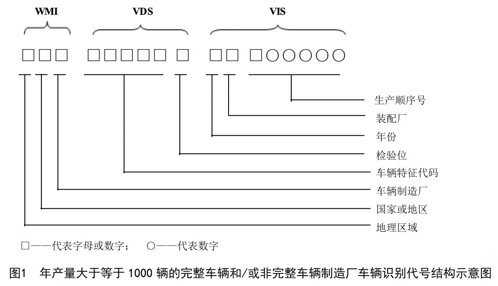
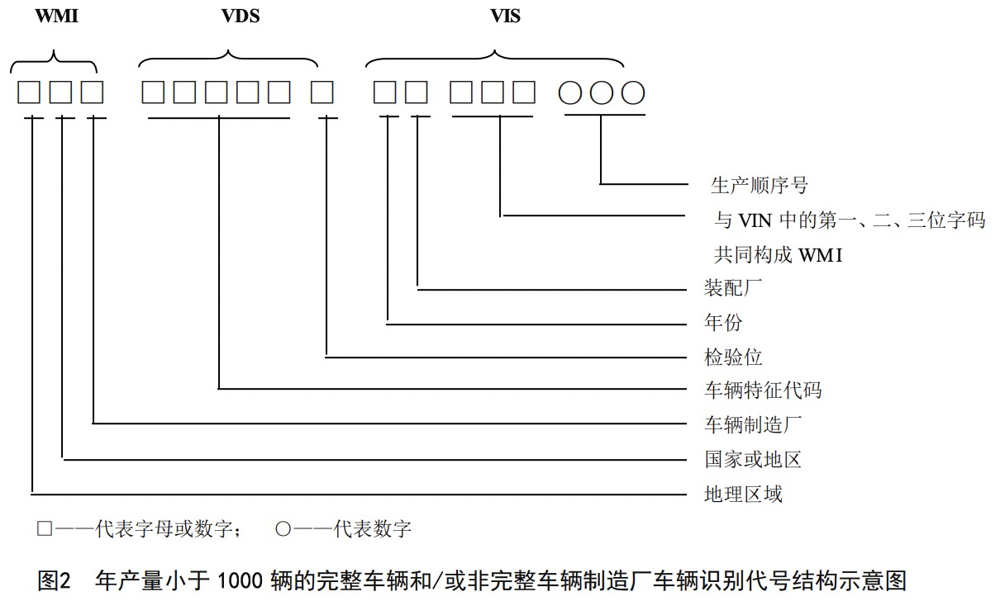

## VIN 码规范（ISO3779-2009标准）
车辆识别代号（vehicle identification number，VIN）由三部分按顺序构成，共 17 位字码（**不能使用 I、O、Q**）。


### 1. 世界制造厂识别代号（world manufacturer identifier，***WMI***）。

### 2. 车辆说明部分（vehicle descriptor section，***VDS***）。
VDS 第六位为检验位，可以是 0～9 第任一数字或者字母“X”。确定了 VIN 的其他十六位代码后，再计算得出。   
1）VIN 中的数字和字母对应值：
```sh
0-1-2-3-4-5-6-7-8-9 # VIN 中的数字
0-1-2-3-4-5-6-7-8-9 # 对应值
A-B-C-D-E-F-G-H-J-K-L-M-N-P-R-S-T-U-V-W-X-Y-Z # VIN 中的字母
1-2-3-4-5-6-7-8-1-2-3-4-5-7-9-2-3-4-5-6-7-8-9 # 对应值
```
2 ）VIN 中的每一位的加权系数：
```js
const LOCATION_WEIGHT_MAP = {
  1: 8,
  2: 7,
  3: 6,
  4: 5,
  5: 4,
  6: 3,
  7: 2,
  8: 10,
  9: '*',
  10: 9,
  11: 8,
  12: 7,
  13: 6,
  14: 5,
  15: 4,
  16: 3,
  17: 2
}
```
3）将检验位之外的 16 位每一位加权系数乘以此位的对应值，再将乘积之和除以 11。
4）除得的余数即检验位；如果余数为 10，检验位为字母 X。

### 3. 车辆指示部分（vehicle indicator section，***VIS***）。
VIS 第一位（VIN 第十位）代表年份。年份代码表（30 年循环一次）。从 2001~2030 的代码（按顺序）为：
`123456789ABCDEFGHJKLMNPRSTVXY`



